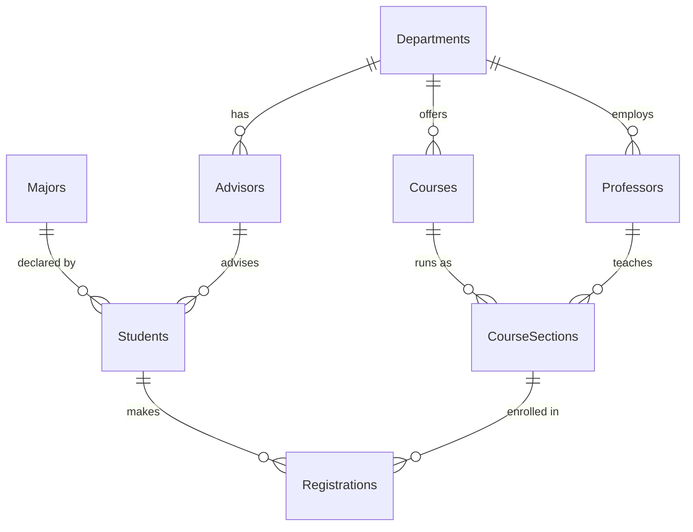

# University Database (T-SQL)

A SQL Server assignment from a Northeastern University database course. It has two parts: a university schema with sample data, and T-SQL queries that answer 14 questions about it.

## Schema

Eight tables linked by foreign keys:



## Queries

`sql/02_queries.sql` answers each question with one query:

| # | Question | SQL used |
|---|---|---|
| 1 | Professors in the Computer Science department | `JOIN` |
| 2–3 | Courses over 3 credits; sections offered in Fall | `WHERE` filters |
| 4 | Distinct semesters with offerings | `DISTINCT` |
| 5–6 | Advisors with `@neu.edu` email; professors whose last name starts with S | `LIKE` patterns |
| 7–8 | Total professors; highest course credits | `COUNT`, `MAX` |
| 9 | Courses per department, including departments with none | `LEFT JOIN` + `GROUP BY` |
| 10 | Departments offering more than 5 courses | `GROUP BY` + `HAVING` |
| 11 | Average credits per department | `AVG` with `CAST` to decimal |
| 12 | Courses sorted by credits | `ORDER BY ... DESC` |
| 13 | Students born in 2000 | `YEAR()` date function |
| 14 | View of courses over 3 credits | `CREATE OR ALTER VIEW` |

With the sample data, queries 5 and 10 return no rows: no advisor has an `@neu.edu` address and no department offers more than 5 courses.

## How to run

You need SQL Server 2016 SP1 or later (or Azure SQL Edge in Docker), plus SQL Server Management Studio, Azure Data Studio or `sqlcmd`.

```bash
sqlcmd -S localhost -U sa -i sql/01_schema_and_seed.sql
sqlcmd -S localhost -U sa -i sql/02_queries.sql
```

`01_schema_and_seed.sql` creates a database named `NEU`. If you run it again, drop that database first.

## Files

| File | Contents |
|---|---|
| `sql/01_schema_and_seed.sql` | `CREATE DATABASE`, 8 tables and sample rows |
| `sql/02_queries.sql` | Answers to the 14 questions |
